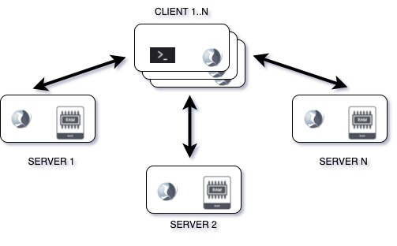

# Distributed key-value store

## Description
In this exercise, you will build and document a system that is intended for accepting and storing the Map<K, V> objects in distributed way.

# How does your system work?
This project implements distributed key value storage.
The key element of the system is the server module - this module includes the storage itself, implemented with the help of a ConcurrentHashMap and the implementation of network interaction with the client application.
When launching this module,
the application allows you to access it using the netty server
and opening a network communication channel on a specific port.  
The server accepts messages in the form of a string, 
the message separator is the line break characters \r\n.

The server supports interaction with the following commands:
- PUT key:value
Accepts a key:value pair and sends it to the server. Where key is any integer and value is any string.
- GET key
Performs to server and tries to retrieve the value for requested key. If the value is found then it should print it to the console. Otherwise it should print the ERR to console
- SHUTDOWN
Shutdowns the server itself 

The client module implements a mechanism for interacting with distributed storage.
During execution, the key is used to calculate server number (the storage server) in which the information should be contained.
+ node number = key.hash % count nodes

The client supports interaction with the following commands:
- PUT key:value
Accepts a key:value pair and sends it to the server. Where key is any integer and value is any string.
- GET key
Performs to server and tries to retrieve the value for requested key. If the value is found then it should print it to the console. Otherwise it should print the ERR to console
- QUIT
Disconnects the client from server and closes the client program with printing BYE
- SHUTDOWN
Shutdowns the server itself and then closes all client programs which were connected to it

## How to run?
- build.sh - create docker container for server code
- run-server.sh - asks about how many nodes you want to run
- run-client.sh - asks about addresses for server nodes, put with 
- > host_server1:port,host_server1:port,host_serverN:port

## What consistency guaranties does your system provide?
+ Processor consistency

## What documentation, websites, papers, etc did you consult in doing this assignment?
+ https://netty.io/
+ https://itsallbinary.com/netty-project-understanding-netty-using-simple-real-world-example-of-chat-server-client-good-for-beginners/
+ https://www.geeksforgeeks.org/hashing-in-distributed-systems/
+ https://medium.com/the-code-vault/data-structures-distributed-hash-table-febfd01fc0af
+ https://levelup.gitconnected.com/system-design-interview-replicated-and-strongly-consistent-key-value-store-b690d8e15c9a
+ https://blog.minhazav.dev/a-fault-tolerant-distributed-key-value-store-from-scratch/

## What third-party libraries or other tools does the system use?
sbt,netty

